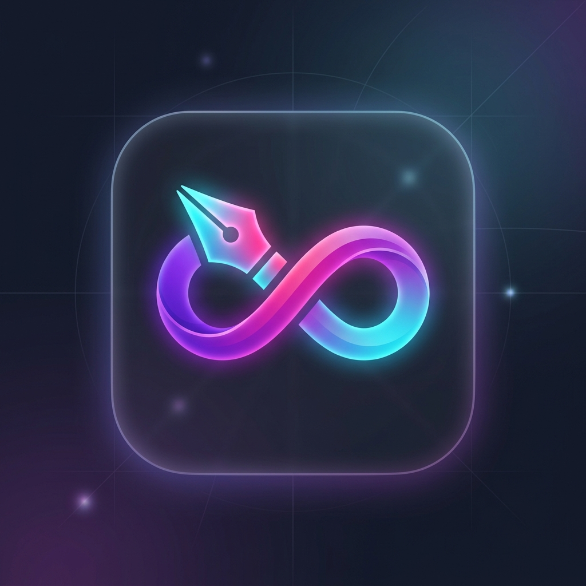

# Gesture Pen: AI-Powered AR Workspace ✍️



An innovative, client-side augmented reality (AR) web application that transforms your standard webcam into a high-precision spatial pointer. Draw, drag-and-drop, and spawn geometry in mid-air with zero physical peripherals.

## 🚀 Features

- **Touchless Drawing Engine**: Maps spatial hand gestures to a virtual 2D canvas, completely eliminating the need for a mouse or stylus.
- **Zero Latency AI**: Powered by Google's MediaPipe Machine Learning models running natively in the browser via WebAssembly (WASM), achieving sub-10ms rendering latency. No backend server required.
- **Velocity-Based Dynamic Smoothing**: Custom One-Euro filtering algorithms dynamically adapt to hand speed, masking micro-jitters during slow, precise drawing while eliminating lag during fast swipes.
- **3D Spatial Hysteresis**: Robust gesture debouncing ensures gestures (like grabbing an object via a pinch) lock in securely and don't flicker.
- **Infinite Canvas**: Interactive zoom and pan workspace powered by Konva.js, featuring dynamic stroke-width scaling to keep ink proportionally sized.
- **Instant Native Export**: Use the "Rock On" (🤘) gesture to instantly capture a high-resolution screenshot of your workspace and download it locally.

## 🖐️ Gesture Controls

- **Hover**: Point your index finger to select tools on the AR Heads-Up Display (HUD).
- **Draw**: Extend your index finger to trace paths in the air.
- **Pause**: Make a closed fist (✊) to pause tracking and rest your hand.
- **Grab/Drag**: Pinch (🤏) your index and thumb together to grab shapes and move them.
- **Spawn Geometry**: Perform a 2-hand pinch-and-pull (👐) to spawn squares, circles, and triangles.
- **Undo**: Give a Thumbs Down (👎) to instantly undo your last action.
- **Change Color**: Hold up 3 fingers (3️⃣) to cycle through the neon color palette.
- **Save Workspace**: Flash the Rock On sign (🤘) to export your canvas to a PNG.

## 🛠️ Technology Stack

- **Frontend Framework**: React.js, Vite
- **Computer Vision ML**: MediaPipe (Tasks Vision)
- **Canvas Rendering**: Konva.js (HTML5 Canvas)
- **Styling**: Vanilla CSS (Glassmorphism & Neon Aesthetics)

## 💻 Running Locally

Because Gesture Pen is 100% serverless, running it locally is incredibly simple:

1. Clone the repository:
   ```bash
   git clone https://github.com/hemangjangra/Gesturepen.git
   ```
2. Navigate into the directory:
   ```bash
   cd Gesture_Pen
   ```
3. Install dependencies:
   ```bash
   npm install
   ```
4. Start the development server:
   ```bash
   npm run dev
   ```

## 🔒 Privacy & Security

Gesture Pen is designed with a strict privacy-first architecture. The application is entirely client-side; your webcam video feed is processed locally on your device's GPU and is **never** sent to an external server or saved in the cloud.
